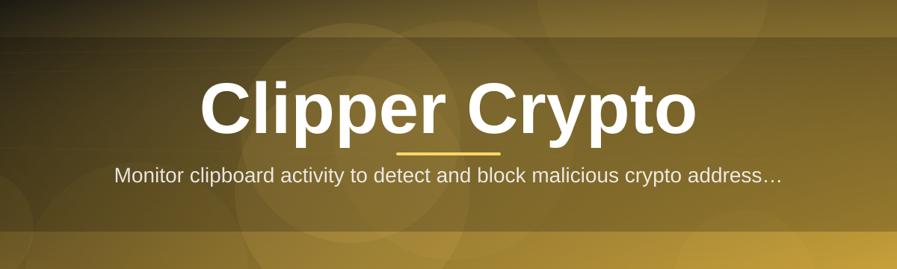
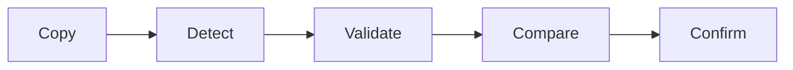

# clipper-crypto-companion 📋🔐

  

*A quiet little watcher that turns your clipboard into a trustworthy checkpoint for every crypto address you copy.*

## 🧭 What This Is NOT

Let's clear the air before anything else. This is **not** a wallet. It's **not** a trading terminal, a portfolio tracker, or a browser extension begging for permissions it doesn't need. It doesn't touch your private keys, doesn't phone home, and doesn't ask you to trust it with your seed phrase — because it never asks for one in the first place.

What clipper-crypto-companion actually is: a small, focused, standalone Windows companion that sits quietly in your system tray and watches one thing — your clipboard — for the split second between "copy" and "paste" where crypto transactions quietly go wrong. It normalizes address formats, flags checksum mismatches, and gives you a calm visual confirmation before you commit funds anywhere.

> [!NOTE]
> This project was born on a weekend, fueled by too much coffee and one too many stories of clipboard-swapped BTC addresses ruining someone's Monday. It grew into something we're genuinely proud to maintain.

## 🔍 Overview

Clipper Crypto exists because the clipboard is the least glamorous, most dangerous part of the modern crypto workflow. You copy an address from an exchange, a wallet, or a Discord message, and by the time you paste it, you're trusting a mechanism that was never designed with adversarial actors in mind. clipper-crypto-companion was built to close that gap — quietly, locally, and without ceremony.

At its core, this is a monitoring layer that lives between your clipboard and your intent. It inspects copied strings for known address patterns — Bitcoin, Ethereum, Litecoin, and a growing list of chains — validates their structure, and surfaces a lightweight confirmation overlay so you can eyeball what you're about to paste. No cloud calls, no telemetry, no accounts. Just a companion that respects the fact that crypto transactions are irreversible and deserves a second look before it's too late.

Who is this for? Anyone who moves digital assets more than once a month and has ever felt that flicker of doubt right before hitting "send." Traders, node operators, OTC desk regulars, and the increasingly paranoid casual holder — this tool was shaped by feedback from all of them, and it keeps evolving because the threat landscape around clipboard hijacking keeps evolving too.

  

---

## ⚡ The Toolbox

- **Live Clipboard Sentinel** — runs in the background at negligible CPU cost, watching only for patterns that look like crypto addresses, ignoring everything else you copy throughout the day.

- **Checksum Verification Engine** — validates addresses against their native checksum algorithms so malformed or tampered strings get caught before they reach a transaction field.

- **Multi-Chain Pattern Library** — recognizes address formats across Bitcoin, Ethereum, Litecoin, and an expanding roster of chains, updated as the ecosystem grows.

- **Swap Detection Heuristics** — compares the address currently on your clipboard against the one that was there moments ago, flagging suspicious last-second substitutions.

- **Silent Tray Presence** — a single, unobtrusive icon that stays out of your way until it actually has something worth telling you.

- **Confirmation Overlay** — a small, dismissible popup that shows the address in full, broken into readable chunks, so eyeballing for tampering is actually feasible.

- **History Ledger (Local Only)** — a rolling, on-device log of recently detected addresses, useful for double-checking recent activity without ever leaving your machine.

- **Zero Network Footprint** — no outbound calls, no analytics pings, no update checks unless you trigger them yourself.

> [!TIP]
> Pin the tray icon. You'll forget it's running, and that's exactly the point — right up until the moment it saves you.

---

## 🚀 Up and Running

Getting clipper-crypto-companion running takes less time than reading this sentence twice.

1. **Visit the landing page** using the button above or below — that's the only place downloads live.

2. **Download the standalone executable** — no installer wizard, no bundled toolbars, no surprises.

3. **Run it directly** — Windows may show a SmartScreen prompt for unsigned apps; click through if you trust the source (you built it into your workflow, after all).

4. **Check the tray** — look for the clipper icon. If it's there, you're protected. If not, check the Troubleshooting section below.

> [!IMPORTANT]
> Because this is a standalone binary with no installer, there's nothing to uninstall beyond deleting the executable and clearing its local history folder. No registry sprawl, no leftover services.

---

## 🖥️ System Requirements

| Requirement | Detail |
|---|---|
| OS | Windows 10 (64-bit) or Windows 11 |
| Dependencies | None — fully self-contained |
| Disk Space | Under 40 MB |
| RAM Footprint | ~15-25 MB idle |
| Network Access | Not required for core functionality |
| Admin Rights | Not required for standard use |

  

---

## ⚙️ How It Works

The architecture is intentionally simple — complexity is the enemy of trust when you're building something that touches financial data, even indirectly.

1. **Capture** — the companion subscribes to Windows clipboard change events, waking up only when clipboard contents actually change.

2. **Pattern Match** — the new clipboard string is run through a lightweight regex and checksum pipeline to determine if it resembles a known crypto address format.

3. **Validate** — if a match is found, the checksum algorithm for that specific chain confirms structural integrity.

4. **Compare & Alert** — the address is compared against recent clipboard history to detect anomalies, and a confirmation overlay appears if anything looks off — or simply to confirm a clean copy.

5. **Log Locally** — the event is appended to an on-device history file, nothing leaves the machine.

---

## 🩺 Troubleshooting

<strong>The tray icon disappeared after I closed my laptop lid.</strong>

Windows sometimes suspends background processes during sleep transitions. Reopen the executable and it'll resume watching immediately — your clipboard history isn't affected.

<strong>It flagged a legitimate address as suspicious. Is that a bug?</strong>

Not necessarily. The swap-detection heuristic errs on the side of caution — if an address changed unexpectedly between two rapid copy actions, it'll flag it even if both were valid. Better a false alarm than a silent substitution.

<strong>Does it support Bitcoin Segwit and Ethereum ENS names?</strong>

Segwit formats are fully supported in the pattern library. ENS name resolution is on the roadmap but currently out of scope, since it would require a network lookup we've deliberately avoided so far.

<strong>Why doesn't it check my clipboard on macOS or Linux?</strong>

The current build targets the Windows clipboard API specifically. Cross-platform support is a frequently requested feature — see the Contributing section if you'd like to help push it forward.

<strong>SmartScreen is blocking the executable. Is that expected?</strong>

Yes — the binary isn't signed with a paid certificate, so Windows treats it as unrecognized by default. Click "More info" then "Run anyway" if you've downloaded it from the official landing page.

> [!WARNING]
> Always verify addresses visually even when the tool gives a green light. Clipper Crypto is a second layer of defense, not a replacement for your own attention.

---

## 🎨 UI / UX Details

The interface was designed to be forgettable in the best way — present when needed, invisible otherwise.

- **Keyboard Shortcuts**
  - `Ctrl+Shift+C` — manually re-check current clipboard contents
  - `Ctrl+Shift+H` — open local history ledger
  - `Esc` — dismiss the confirmation overlay instantly

- **Themes** — Light, Dark, and an Auto mode that follows your Windows accent color settings.

- **Settings Panel** — toggle which chains are actively monitored, adjust overlay duration, and clear local history with one click.

> [!TIP]
> If the confirmation overlay feels intrusive, dial its display duration down to 2 seconds in Settings — enough time to glance, not enough to annoy.

---

## 🤝 Contributing & Community

This started as a weekend project and grew because people kept asking for "just one more chain" or "just one more heuristic." That energy is exactly what keeps it alive.

- Open an issue if you've spotted a false positive, false negative, or a chain we haven't covered yet.
- Pull requests are welcome — especially around new address format support and cross-platform groundwork.
- Discussions are the best place to propose bigger architectural changes before diving into code.

> Every contribution, no matter how small, moves clipper-crypto-companion closer to being the quiet safety net the whole crypto community deserves.

---

## 📄 License

Released under the [MIT License](LICENSE), 2026. Use it, fork it, build on it — just carry the license forward.

---

## ⚠️ Disclaimer

clipper-crypto-companion is a clipboard-monitoring utility provided as-is, with no warranty of any kind. It does not manage funds, sign transactions, or store private keys. It is a supplementary safeguard, not a substitute for careful manual verification of every address before sending crypto assets. The maintainers assume no responsibility for losses resulting from misuse, missed alerts, or reliance on this tool as a sole line of defense.

  

